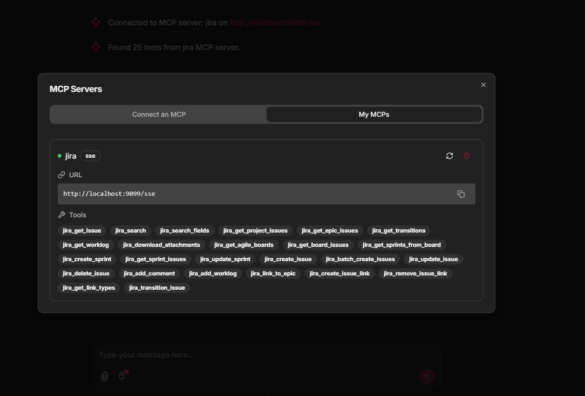
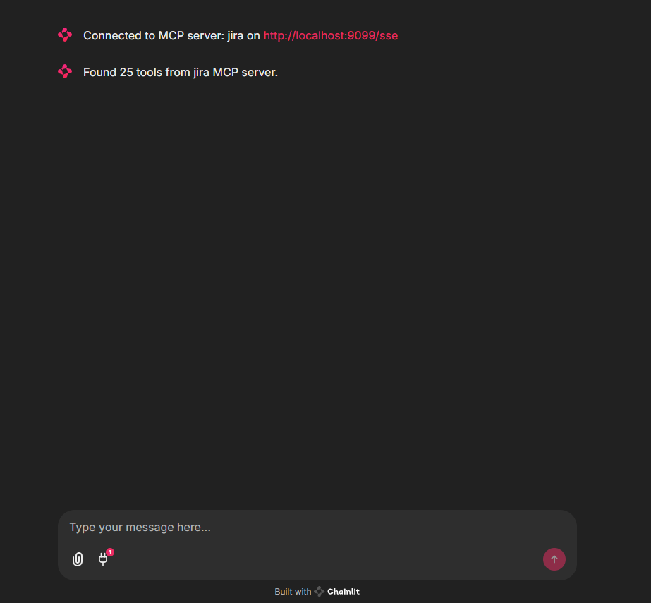
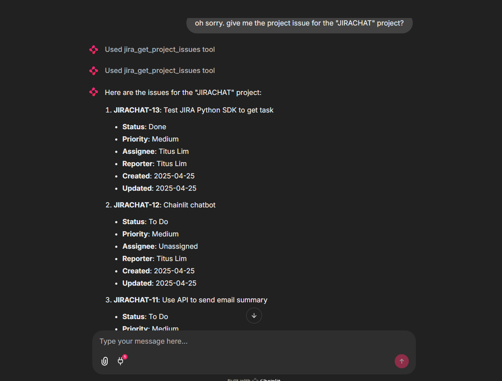
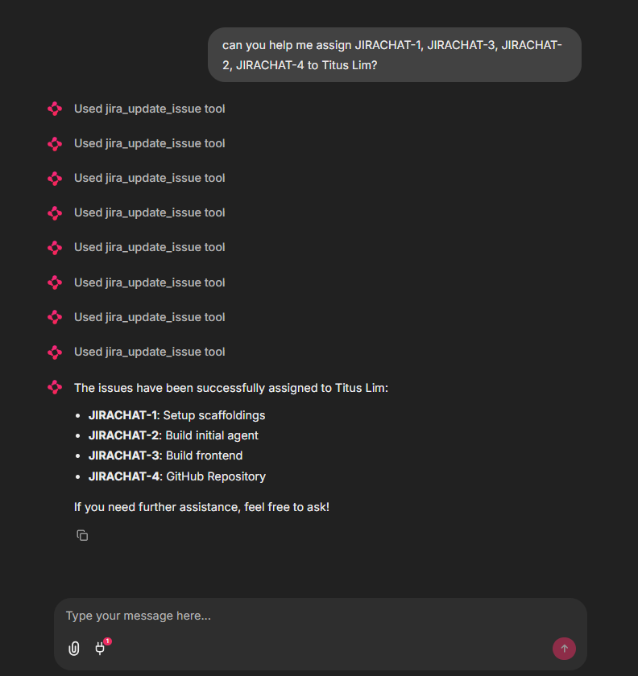
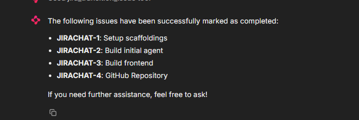
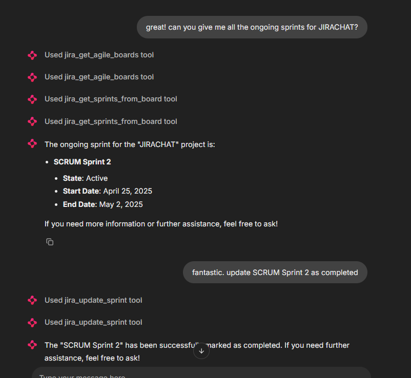

# sturdy-octo-fortnight
The Chainlit introduction repository

## Setup
### Install the requirements
```
poetry install
```
### Pull the docker image
```
docker pull ghcr.io/sooperset/mcp-atlassian:latest
```

### Environment variables
Here are the environment variables needed for the MCP server
```
"CONFLUENCE_URL": "https://your-company.atlassian.net/wiki",
"CONFLUENCE_USERNAME": "your.email@company.com",
"CONFLUENCE_API_TOKEN": "your_confluence_api_token",
"JIRA_URL": "https://your-company.atlassian.net",
"JIRA_USERNAME": "your.email@company.com",
"JIRA_API_TOKEN": "your_jira_api_token"
```

We use Azure OpenAI for this use case but any LLM will do. Be sure to key in the LLM's API key into the .env file.

### Run the container
```
docker run --rm -p 9000:9000 \
  --env-file ./.env \
  ghcr.io/sooperset/mcp-atlassian:latest \
  --transport sse --port 9000 -vv
```
### Connect to the mcpServer
```
{
  "mcpServers": {
    "mcp-atlassian-sse": {
      "url": "http://localhost:9000/sse"
    }
  }
}
```

## Key Tools

### Confluence Tools

- `confluence_search`: Search Confluence content using CQL
- `confluence_get_page`: Get content of a specific page
- `confluence_create_page`: Create a new page
- `confluence_update_page`: Update an existing page

### Jira Tools

- `jira_get_issue`: Get details of a specific issue
- `jira_search`: Search issues using JQL
- `jira_create_issue`: Create a new issue
- `jira_update_issue`: Update an existing issue
- `jira_transition_issue`: Transition an issue to a new status
- `jira_add_comment`: Add a comment to an issue

<details> <summary>View All Tools</summary>

|Confluence Tools|Jira Tools|
|---|---|
|`confluence_search`|`jira_get_issue`|
|`confluence_get_page`|`jira_search`|
|`confluence_get_page_children`|`jira_get_project_issues`|
|`confluence_get_page_ancestors`|`jira_get_epic_issues`|
|`confluence_get_comments`|`jira_create_issue`|
|`confluence_create_page`|`jira_batch_create_issues`|
|`confluence_update_page`|`jira_update_issue`|
|`confluence_delete_page`|`jira_delete_issue`|
||`jira_get_transitions`|
||`jira_transition_issue`|
||`jira_add_comment`|
||`jira_add_worklog`|
||`jira_get_worklog`|
||`jira_download_attachments`|
||`jira_link_to_epic`|
||`jira_get_agile_boards`|
||`jira_get_board_issues`|
||`jira_get_sprints_from_board`|
||`jira_get_sprint_issues`|
||`jira_create_sprint`|
||`jira_update_sprint`|
||`jira_get_issue_link_types`|
||`jira_create_issue_link`|
||`jira_remove_issue_link`|

</details>

## Connect to the MCP
First run the MCP container and then spin up the chainlit app
```
chainlit run app.py
```

Then click the "cable" connector in the chatbar and connect to the Jira MCP
<p align="center">
    
</p>
<p align="center">
    
</p>

Then start chatting!
<p align="center">
    
</p>
<p align="center">
    
</p>
<p align="center">
    
</p>
<p align="center">
    
</p>
<p align="center">
    
</p>
